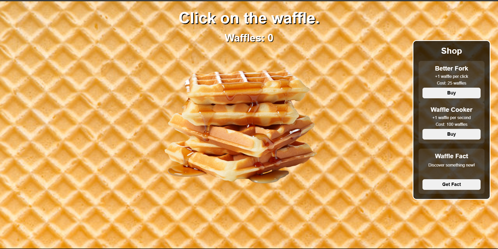

# Waffle Click Simulator

Waffle Click Simulator is a clicker "game"; I made it because I like waffles and I enjoy creating games.

### Technologies used
I used standard technologies:
HTML,
CSS,
JavaScript.

### Visualitation

The goal of the game is to click on the waffle and gradually make upgrades; I plan to add a small leaderboard in the future.

Marcinho loves you all.